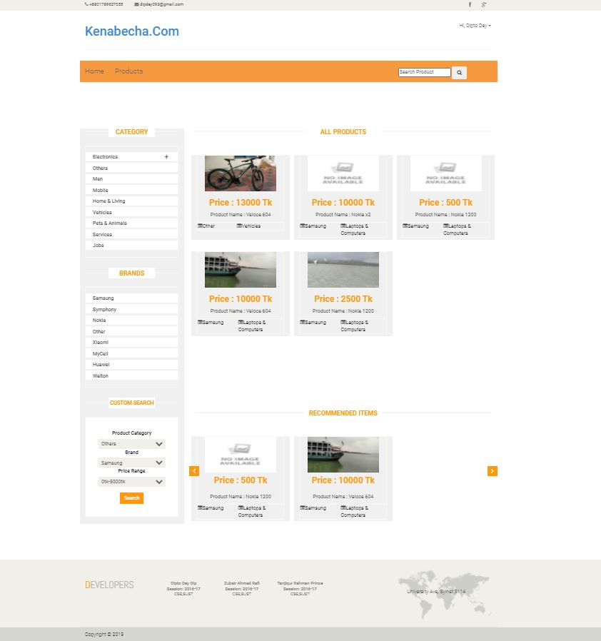
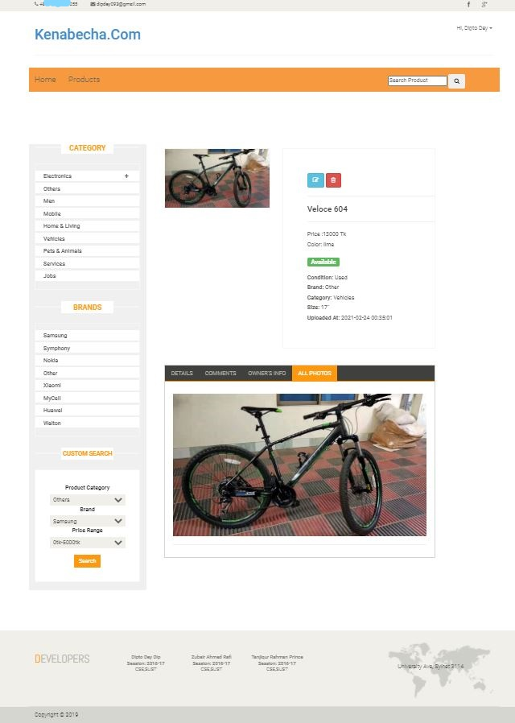
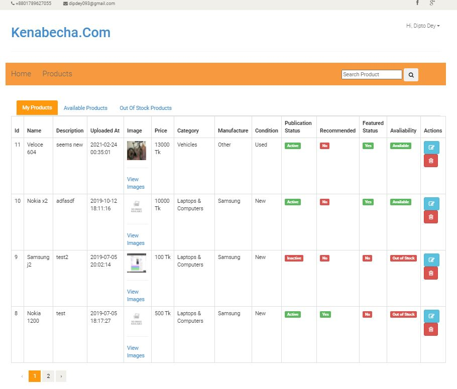
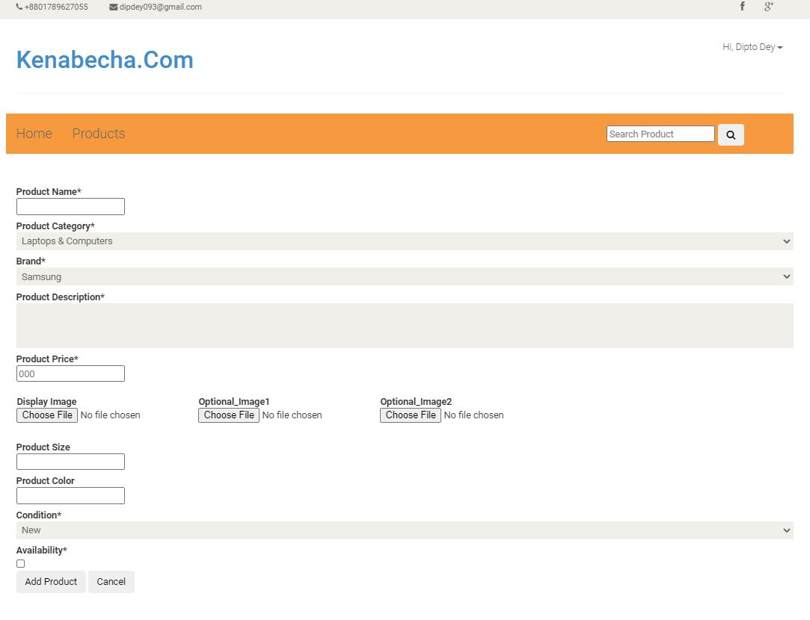

# Kenabecha#com
This is a E-commerce site where one can post ads and contact with other sellers

It was developed as a course work for DBMS lab course (3/1)

# About website
A visitor must have an account to see product details and post a product.
A user can post a product which will be reviewed by an admin.
Thus it has admin dashboard from where everything inside this website can be monitored.

## Framework
Laravel  5.6.39
## Templating Engine
Blade
## Server Side Language
PHP

**Some SS from DigitalComplainBox:**

 
 
 

